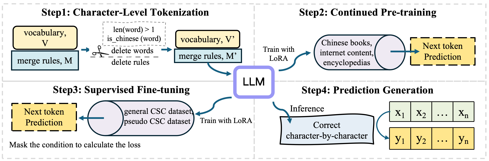

# C-LLM
This is the source code for the paper "C-LLM: Learn to Check Chinese Spelling Errors Character by Character" （https://arxiv.org/pdf/2406.16536 ）


# Environment
* Python: 3.8
* Cuda: 12.0 (NVIDIA A100-SXM4-40GB)
* Packages: pip install -r requirements.txt

## Data

### Train
* Data for Continued Pre-training: Tiger-pretrain-zh (https://huggingface.co/datasets/TigerResearch/pretrain_zh)

* Data for Supervised Fine-tuning (see /dataset/train_date/): 
    
    * Train: [Wang271K](https://github.com/wdimmy/Automatic-Corpus-Generation), [CSCD-NS](https://github.com/nghuyong/cscd-ns/tree/master) (train)
    * Dev: CSCD-NS (dev)

### Test
See /dataset/test_date/:
* General Dataset: CSCD-NS (test)
* Multi-Domain Dataset: LEMON (https://github.com/gingasan/lemon/tree/main/lemon_v2)

## Character-Level Tokenization 
First, run [tokenizer_prune_qwen.py](https://github.com/ktlKTL/C-LLM/blob/main/tokenizer_prune_qwen.py) to trim the vocabulary for BPE-based tokenization. Next, run [pruner.py](https://github.com/ktlKTL/C-LLM/blob/main/pruner.py) to update the model embeddings with the new vocabulary.

```
python tokenizer_prune_qwen.py 
python pruner.py
```

## Continued Pre-training
The training data comprised approximately 19B tokens, but we trained for 30,000 steps, covering about 2B tokens. The backbone model is [QWEN1.5](https://huggingface.co/collections/Qwen/qwen15-65c0a2f577b1ecb76d786524). 


## Supervised Fine-tuning
After the above steps are completed, run [train.sh](https://github.com/ktlKTL/C-LLM/blob/main/train.sh) for fine-tuning.

`sh train.sh`

## Inference
After fine-tuning, run [test.sh](https://github.com/ktlKTL/C-LLM/blob/main/test.sh) for inference. Please modify the parameter path in the script is updated to match the path where you have saved the parameters.

`bash test.sh`

## Evaluation
Two methods for handling unequal length sentences were designed: one based on [CheRRANT](https://github.com/HillZhang1999/MuCGEC/tree/main/scorers/ChERRANT) and the other on [difflib](https://github.com/python/cpython/blob/main/Lib/difflib.py). In this paper, we adopted the CheRRANT-based method. For evaluation, CheRRANT must first be downloaded to the specified directory.

Run [evaluate_result.py](https://github.com/ktlKTL/C-LLM/blob/main/evaluate_result.py) for evaluation:

`python evaluate_result.py`

The script for calculating metrics is adapted from [CSCD-NS](https://github.com/nghuyong/cscd-ns/blob/master/evaluation/evaluate.py).
## Citation
If you find this work is useful for your research, please cite the following paper: C-LLM: Learn to Check Chinese Spelling Errors Character by Character （https://arxiv.org/pdf/2406.16536 ）
